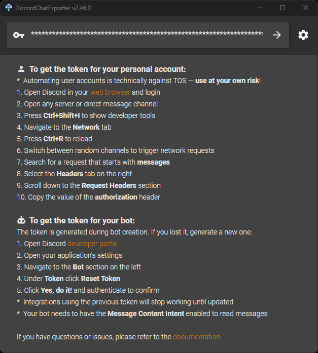
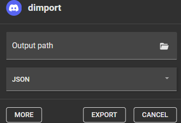
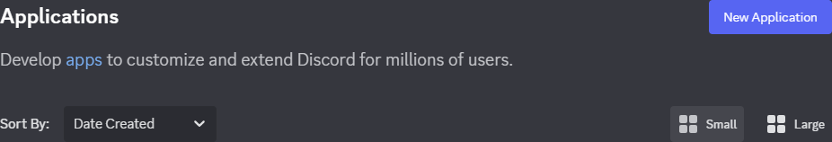
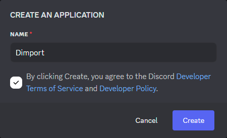
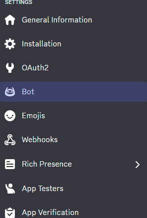
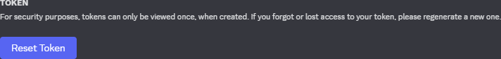
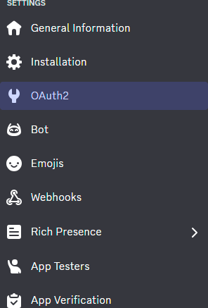
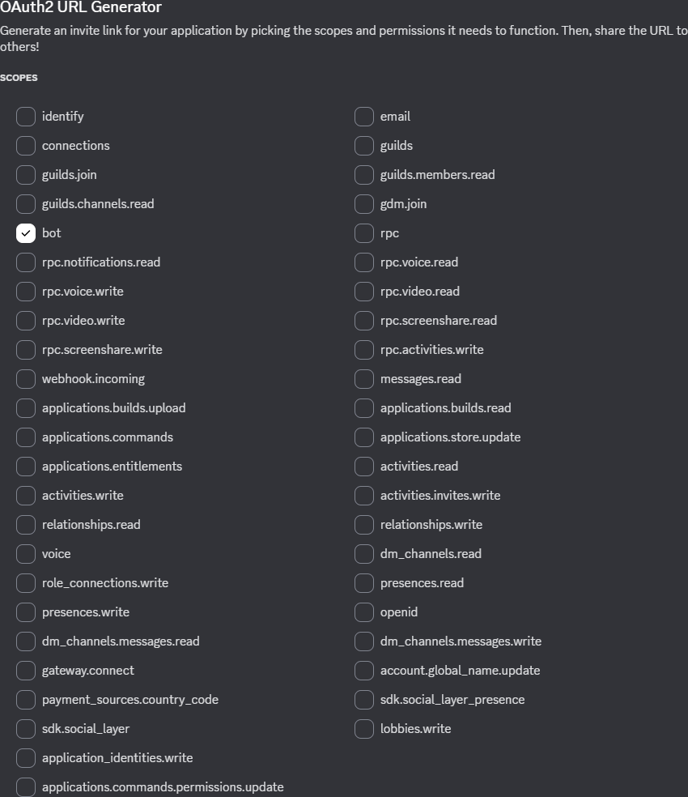
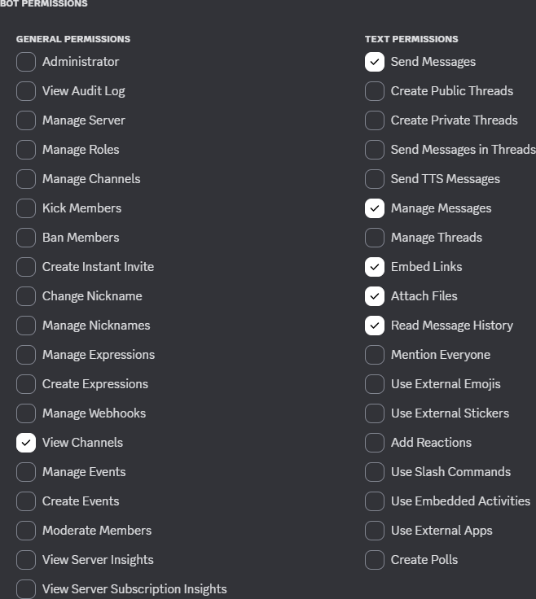
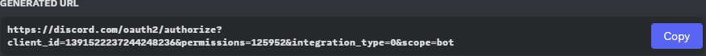

## Export

1. Open [DiscordChatExporter](), follow instructions to get the token, paste, and press `Enter`.

2. Select `# chat` you want to export.

3. Click on the `Download` button.

4. Select `JSON` instead of `TXT`, click on the `Export` button, and select the output directory and filename.

## Create

1. Go to [My Applications | Discord Developer Portal](https://discord.com/developers/applications) and click on the `New Application` button.

2. Select `Name`, check out Discord [Terms of Service](https://support-dev.discord.com/hc/articles/8562894815383-Discord-Developer-Terms-of-Service) and [Developer Policy](https://support-dev.discord.com/hc/articles/8563934450327-Discord-Developer-Policy), and click on the `Create` button.

3. Select `Bot` on the left side panel.

4. Click on the `Reset Token` button.

5. Click on the `Copy` button.

6. Switch on `Message Content Intent`.

7. Select `OAuth2` on the left side panel.

8. Select `bot` inside `Scopes`.

9. Select `Send Messages`, `Manage Messages`, `Embed Links`, `Attach Files`, `Read Message History`, and `View Channels` inside `Bot Permissions` (`permissions=125952`).

10. Click on the `Copy` button.

## Start

1. [Download the executable](https://github.com/Inc44/Dimport/releases).

2. Add to the environment variable or create .env with `DISCORD_TOKEN=your_bot_token` in the current directory.

3. Double click on the `Dimport.exe` file or run from the command line `Dimport`.